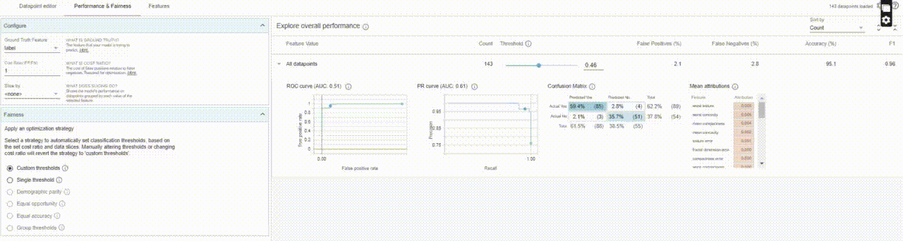

# What-If-Explainability

### WIT Usage

 * Interactively changing a feature value and seeing how the prediction scores and the SHAP values change. It’s really useful if we want to understand if the model has   learned the feature space in a way that can be explained with common sense. For instance, let’s say we are trying to predict the price of an apartment. If all the features are constant, we expect the price to go up if we increase the area.

 * Instead of experimenting with many samples, we can also look at the partial dependence plot of the feature directly if we are only interested in the change in the model score. The partial dependence plot (short PDP or PD plot) shows the marginal effect one or two features have on the predicted outcome of a machine learning model (J. H. Friedman). A partial dependence plot can show whether the relationship between the target and a feature is linear, monotonic, or more complex.
 
 
 
 * We can also simply look at the feature distribution.
 
  
  
  * A counterfactual explanation indicates the smallest change in feature values that can translate to a different outcome. What-if counterfactuals answer the query of what the model would forecast in the event that you altered the action input. They make it possible to comprehend and troubleshoot a machine-learning model by observing how it responds to input (feature) changes. Conventional interpretability approaches can rank features based on their predictive value or approximate a machine learning model. Contrarily, counterfactual analysis “interrogates” a model to discover what adjustments to a certain data point might cause the model’s conclusion to alter. In simple words, let’s say we have two very similar cancer samples, and the feature values look very similar still one is benign and another is malignant! WIT will find you counterfactual samples for any data point.
  
 
 
 * You can adjust the threshold for a classification problem to optimize precision or recall in WIT too.
 
  
